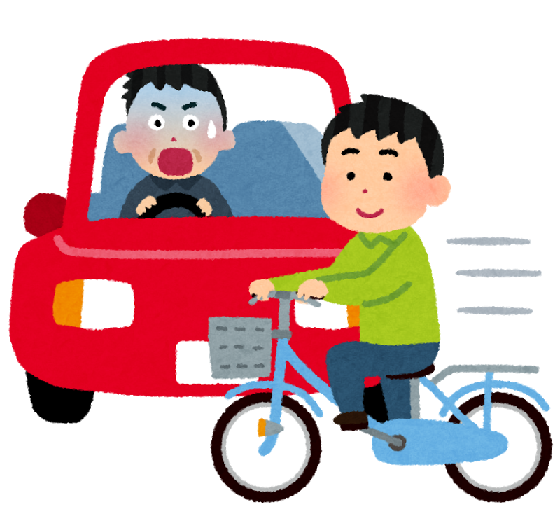
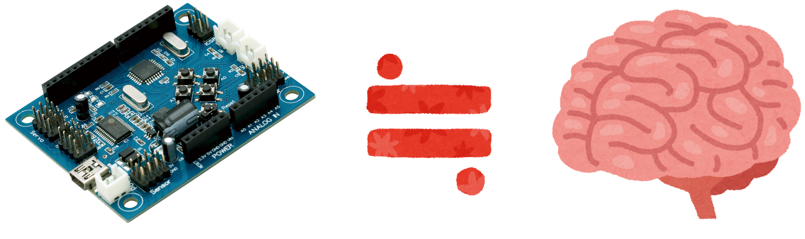

% コンピューティングによる課題解決体験ワークショップ
% 地域おこし協力隊 水野佑紀
% 2019-02-19

 

https://github.com/MizunoYouki/computing-for-problem-solving-workshop/ にすべての資料があります。

興味のある人は、大人の人と一緒に見てみてね。

# プログラミング体験 - みんなの困りごとを解決しよう

## 「友だちが横断歩道で車にはねられそうになったの」

{ width=200px }

横断歩道を渡れないようにしよう

\
)

## 「車にはねられることはなくなったけど、道路を渡れなくなったの」

しばらく待ったら、横断歩道を渡れるようにしよう

\
)

## 「今度は、車が渋滞するようになったの」

人も車も通れるようにしよう

\
)

## 「横断途中で、突然赤になるのが怖いの」

点滅で知らせよう

.PNG)\
(examples/d2. 点滅(for).PNG)\
)

## 「信号を操作する係の人が、旅行に行きたいって」

永遠に繰り返す信号をつくろう

\
)

## 「渡る人がいないのに待つの？」

押しボタン式信号をつくろう

.PNG)\
(examples/f2. 押しボタン(while-if).PNG)\
)

## 目の不自由な人が困っているよ

- どうしたらいい？ 考えてみよう
  - 　
  - 　
  -  　

\
)

# コンピューティングによる課題解決体験 - 発明家になろうワークショップ

## マイコンってなんなの？(5 min)

先ほど信号を制御していたのは「マイコン」というコンピュータの一種です。

（いろいろなコンピュータ）

| 名称 | 特徴 |
|-|-|
|マイコン(マイクロコントローラ)|特定の電子機器を制御することに特化。小さい。100円～|
|マイコン(マイクロコンピュータ)|小さなコンピュータ。いろんな用途。パソコンと比べたら遅い。1000円～|
|パソコン(パーソナルコンピュータ)|いろんな用途。50000円～|
|スマホ(スマートフォン)|いろんな用途。電話できる。10000円～|
|サーバー|他のコンピュータから要求を受けて、結果を返すためのコンピュータ。Googleなどがたくさん保有している。|

マイコンなどのコンピュータは、身のまわりにたくさん存在します（マイクロコントローラは、ほぼすべての電子機器や家電に入っています）

さきほどはマイコンという脳みそを使って（**プログラムで処理**）、困りごとを解決したり、新しい価値（旅行に行ける）を産みだすことができましたね。

  - 4000億回（最近のパソコンやスマホ、ニンテンドースイッチ 400GFLOPS）
  - 25億回 (Q507/PE 2.5GFLOPS)
)

コンピュータを人間（脳みそ）と比べてみよう。

  * 脳みそよりすごいこと（四則演算の速さや、それを活かした「薬の開発」「天気予報」「YouTubeの多言語字幕」など）
  * 脳みそにはかなわないこと（アイデアを発想することなど）

)

## 「外の世界」からコンピュータにはたらきかけよう(3 min)

)

センサーは人間の「五感」のように、外の世界を感じることができるよ。人間にはない感覚も感じることができるよ。

外の世界から、マイコンやコンピュータにはたらきかけることを **入力** といいます。

人間は、コンピュータへ、文字や数値や画像などを入力することができますが、**センサー** も、コンピュータへ、感じとった値を入力することができます。

| | | |
|-|-|-|
|どれだけ回転したか|どれだけ離れているか|どの方向へ動いているか|
|動いている速度|どれだけ急に動いたか|どれだけねじれたか|
|地球上のどこにいるか|どの方角を向いているか|磁力の強さ向き|
|気温|湿度|気圧|
|すっぱい苦い|匂い|紫外線・赤外線の強さ|
|音の高さ|音の大きさ|音の種類|
|色|明るさ||
|モノの識別|モノが空間に存在するかどうか||

これらのセンサーの多くは、スマートフォンに内蔵されているよ。

## コンピュータから「外の世界」にはたらきかけよう(0 min)

マイコンやコンピュータから、外の世界にはたらきかけることを **出力** といいます。

ありとあらゆる出力方法があります。

| |
|-|
|LEDを光らせる, 点滅させる|
|しゃべる・音を出す|
|モーター（とギアやアームなどの組み合わせ）を動かす|
|VRで映す|
|印刷する|
|画面に表示する|
|LINEメッセージを送る|
|はがきを送る|

## コンピュータどうしをつなげよう(5 min)

マイコンやコンピュータや人間は、互いに協力しあうことができます。

離れた場所と通信するための方法のひとつに **インターネット** があります。

インターネットは地球の隅々（や宇宙に）にはりめぐらせられているので、遠く離れた場所にあるコンピュータ同士が瞬時に通信（はたらきかけを依頼したり、受け取る）できます。

インターネットでは、さまざまな通信が行われています。

 - ホームページを見る / 公開する
 - YouTubeやTikTokやInstagramを見る / 投稿する
 - LINEメッセージを送る / 見る
 - 自動調理なべのレシピを公開する / 手に入れる

スゴいコンピュータへ依頼すると、こんなこともわかるよ

| | | |
|-|-|-|
|画像内の物体を認識|画像内の文字|手書き文字|
|画像内の人物名|画像内の建物名|画像内の人物について(性別・感情・年齢・化粧の有無など)|
|何語を話しているか？|音声をテキストへ|話している人の年齢・性別|
|会話を続けるため何を返答すればよいか？|||

インターネットは主に光ファイバーケーブルを、海底などに敷いて実現されていますが、電波を使うことで配線を不要にした方法もいくつかあります。

- 無線LAN(Wi-Fi) は、配線の難しい場所や、移動をともなう際に使われます
- Bluetooth も同様ですが、わずかな電力で動作するので、電池を使う機器でよく使われます。ただし通信できる範囲も小さく(数m)なります。
  - ワイヤレスイヤホン
  - 無線マウス
  - 心拍計
- LPWA(低消費電力・広範囲)ネットワークは、低速だが、ごくわずかな電力で、遠距離でも通信できます
  - ひずみセンサーを組み合わせて、橋やトンネルが崩れそうな時教えてくれる

)

## みんなで「発明」をしよう！

これからの時代、コンピュータがどんどん「かしこく」なっていきます。

「人間」だけが持つすばらしい力が「頭でたくさん考えること」「言葉で伝えること」です。

そんな力を使って「発明」をしてみましょう。

### 身のまわりにある課題を見つけよう (7min)

自分, 家族, 友だちが困っていることは何だろう？

 - こんな嫌なことがあった
 - 良いことがあった（だから長く続くといい）
 - もっと〇〇だったらいいのにな

ふせんに概要を書いてみましょう

たとえば・・・

- 朝起きれない
- 雪かきしていたら玉ねぎをもらった
- けんかしたけど仲直りしたい
- 嫌われていると思って避けていた。久しぶりに話したら、そうではないだけでなく、楽しかった。
- 忘れ物をした、してないか不安
- 当番を忘れていた
- 食べものアレルギーで、給食が不安
- カメムシがたくさん

### 課題を共有しよう(5min)

課題を他の人に伝えよう。他の人の課題も聞いてみよう。

 - ふせんを貼りながら、課題について発表する
 - 新たに気づいた課題も発表しよう

[ルール]

 - 否定しない
 - 自信を持って、発表は1回30秒以内で！
 - たくさん発表する
 - 解決可能かどうかは気にしなくていい

最も切実/共感できる課題は何だっただろうか？　**ひとつ選択** しよう

### 課題を解決するアイデアを考えよう(10min)

課題を解決するアイデアを発想してみよう！

[ヒント]

- マイコンやセンサー、サービスを使ってみたらどうかな？
- 解決する方法（どのセンサー？サービス？）がわからなければ、詳しそうな人に聞こう
- 先入観を持たずに考えよう

[例]

- 教科書や副教材を忘れると恥ずかしい・・・
  - 各教科で必要なものを、スマホに入力した
  - 時間割を、スマホに入力した
  - 学校へ持っていくモノに、QRコードを貼り付けた
  - 明日の準備でかばんに入れる際、必要なものがスマホに表示される
  - 「ピッ」とスキャンしてかばんに入れるので、考えなくてよいし、忘れることもない

### 課題を解決するアイデアを発表しよう(10min)

課題と、解決のアイデアについて発表しよう！

- 画用紙に、課題と、解決するためのアイデア　を書こう
- 口頭で説明しよう

#### 他の人はどうしてる？（3min）

- D Free（https://readyfor.jp/projects/DFree）
  - 外出先にトイレがなくてもらした、もらしそうになる
  - いつトイレに行きたくなるか分からない/回数が多いので、外出が不安だ
  - 心身が弱り、トイレに行くまでに時間がかかるようになり、間に合わないことがある
  - いつトイレ介助を依頼されるか分からない/回数が多いので、気が休まらない
    - 超音波センサーをへそのあたりに貼り、膀胱などと[どれだけ離れているか]はかることで尿の量を推定して、サーバへ送信するプログラムをつくった
    - 本人や介助する人がサーバへ問い合わせると、排泄したこと、排泄しそうなことが分かる

- Farmnote Color (https://farmnote.jp/color/)

- 課題の本質に着目して、あらたな解決方法を用いた例（デザイン思考）
  - トイレが汚れてしまう

    → トイレに的をつくった（http://copywriterseyes.hatenablog.jp/entry/2016/01/05/220207）

  - MRI受診が怖い

    → MRI装置と壁に絵を描いて、海賊船にした。「海賊に見つからないようじっとしていてね」(http://biz-journal.jp/2016/05/post_15174.html)

